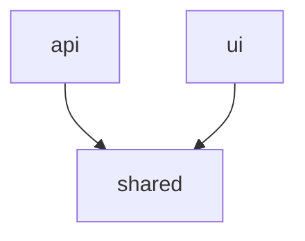

# CLAUDE.md

This file provides guidance to Claude Code (claude.ai/code) when working with code in this repository.

When working with this codebase, prioritize readability over cleverness. Ask clarifying questions before making architectural changes.

## Common Commands

```bash
# Set the right Node version
nvm use

# Install all dependencies (from project root)
npm install

# Build all packages (required before first run — shared packages must be compiled)
npm run build

# Run all packages in dev/watch mode
npm run dev

# Run all tests
npm run test

# Run tests for a specific workspace
npm run test --workspace=@repo/use-cases
npm run test --workspace=@repo/api

# Run a single test file
npx jest --config apps/api/jest.config.js path/to/file.test.ts

# Type-check without emitting
npm run lint

# Format code with Prettier
npm run format

# Clean dist and node_modules
npm run clean
```

## Architecture

This is a **Turborepo monorepo** with npm workspaces, using **hexagonal architecture** (ports & adapters).

### Workspace Layout

- `apps/api` — NestJS REST API (port 3001). Controllers, auth (Passport + JWT), and adapter implementations.
- `apps/ui` — React + Vite frontend (port 3000). Proxies `/api` requests to the API.
- `packages/shared` — Cross-package types (e.g. `UserLoginRequest`) to be used by API and UI as contract.
- `packages/test-config` — Shared Jest base configuration used by all packages.

### Dependency Flow



It is important to note that the `ui` should not use or import from `use-cases`.

Packages must be built (`npm run build`) before apps can import them.

### Key Patterns

- **Repositories**: Abstract `UserRepository` in use-cases, with `InMemoryUserRepository` as the current implementation.
- **Error mapping**: Domain errors (e.g., `UserAlreadyExistsError`) are mapped to HTTP status codes in `apps/api/src/filters/error-mappings.ts` and caught by a global exception filter.

## Standards

- One class per file.
- Test file naming:
  - Unit tests: `file-name.test.ts`
  - Integration tests: `file-name.spec.ts`
- Unit tests should be placed close to the file they are testing.
- Node.js >= 24 (see `.nvmrc`). Package manager: npm.
- Do not use open versions, but fixed ones, for dependencies.
